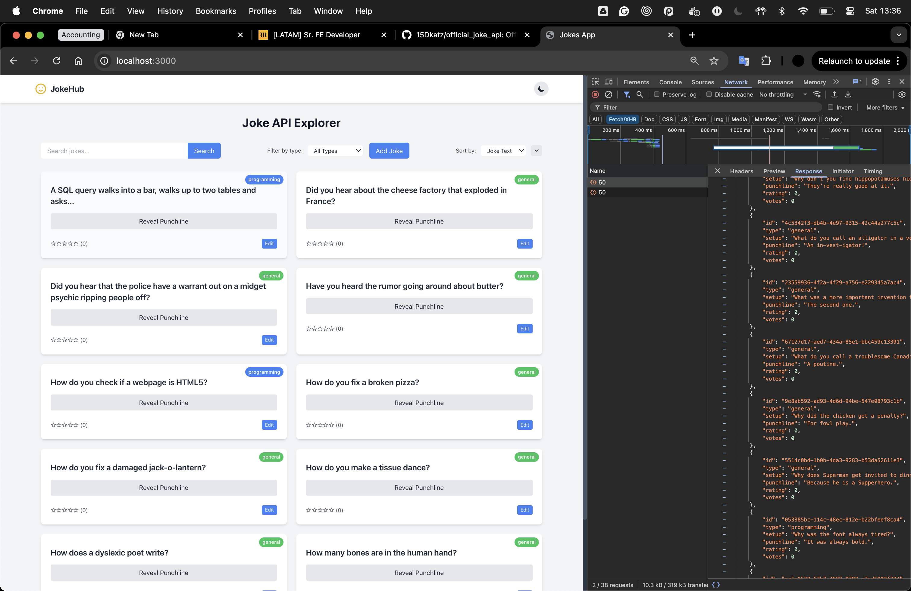
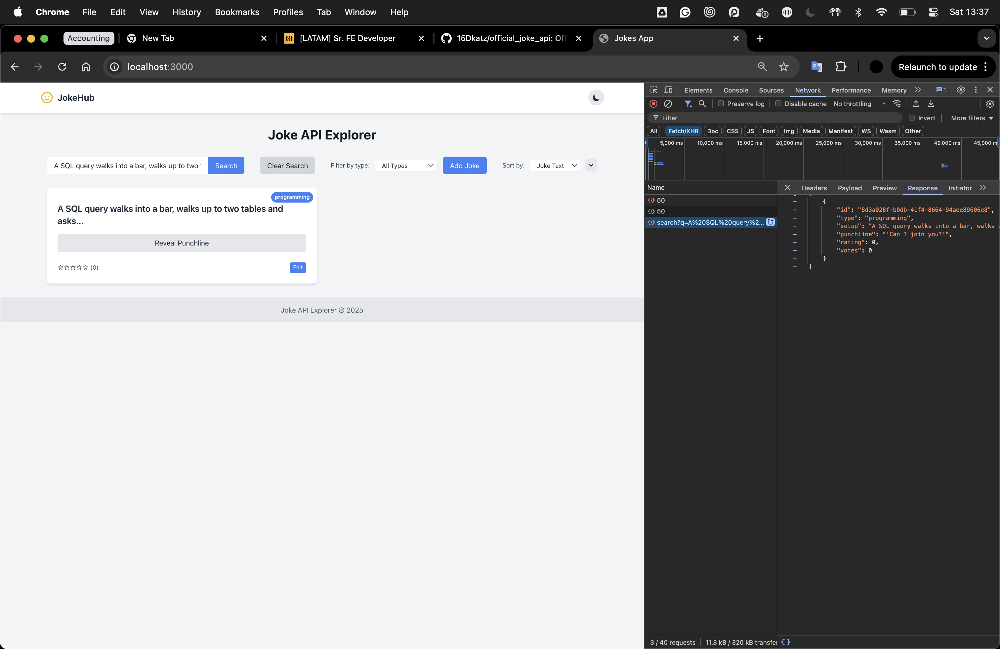
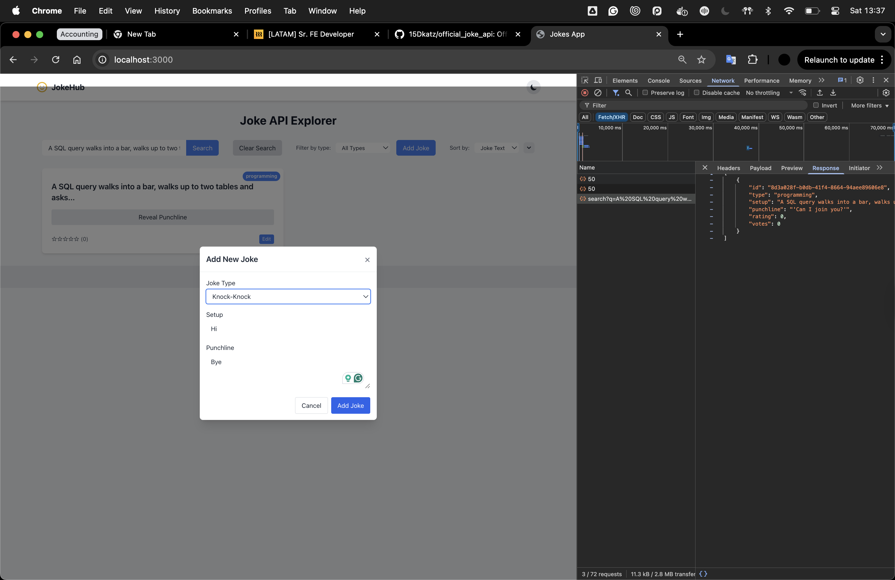
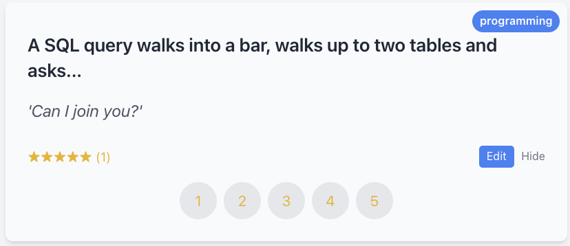
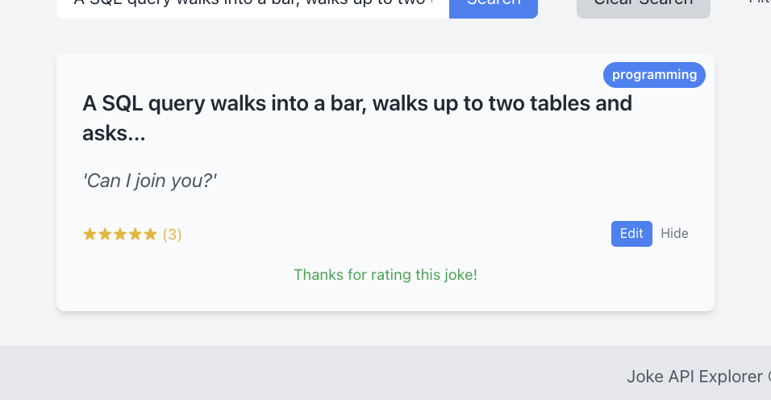

# JokeHub - A TypeScript-Powered Joke API Explorer

This project consists of:

1. A TypeScript-converted Joke API (backend)
2. A React TypeScript frontend for exploring and rating jokes



## Overview

JokeHub is a full-stack TypeScript application that demonstrates modern web development practices. The project has been improved with enhanced TypeScript support, better error handling, and a more robust architecture.

## Backend: TypeScript-Converted Joke API

- Full TypeScript type definitions
- Improved code organization with modular architecture
- Enhanced error handling with detailed error responses
- PostgreSQL database integration with connection pooling
- In-memory caching for improved performance

### API Endpoints

- `GET /random_joke` - Get a random joke
- `GET /random_ten` - Get 10 random jokes
- `GET /jokes/random/:num` - Get a specified number of random jokes
- `GET /jokes/:type/random` - Get a random joke of specific type
- `GET /jokes/:id` - Get a joke by ID
- `GET /types` - Get all joke types
- `POST /jokes` - Add a new joke
- `PUT /jokes/:id` - Update an existing joke
- `POST /jokes/:id/rate` - Rate a joke

## Frontend: React Joke Explorer

Features:

- Dark/light mode toggle with theme persistence
- Pagination for browsing jokes with customizable page size
- Advanced filtering by joke type with intuitive UI
- Flexible sorting by setup text, type, or rating
- Interactive rating system with immediate feedback
- Responsive design for mobile and desktop
- Interactive UI with reveal/hide punchline animations

## Development Tools & Testing

### API Test Tool

The project includes a standalone HTML-based API testing tool at `frontend/test-api.html`. This tool allows you to:

- Test all API endpoints directly without the full React app
- Fetch random jokes individually or in batches
- Create, update, and rate jokes with a simple interface
- View error messages and response data in a structured format
- This is particularly useful for API development and debugging

### VSCode Extensions & Settings

This project includes preconfigured VSCode settings in `.vscode/settings.json` that provide:

- Custom color theme for the workspace
- [Restore Terminals](https://marketplace.visualstudio.com/items?itemName=EthanSK.restore-terminals) extension settings for automated terminal setup
- Automatically opens 5 terminal instances configured for:
  1. Backend development server
  2. Frontend development server
  3. Backend tests in watch mode
  4. Frontend tests in watch mode
  5. Database setup script

To use these settings:

1. Install the Restore Terminals extension in VSCode
2. Open the project in VSCode
3. Use the command palette (Ctrl+Shift+P) and select "Restore Terminals: Restore"
4. All development environments will be automatically set up

## Database Setup

⚠️ **IMPORTANT**: Please review `official_joke_api-master/scripts/setup-db.sh` before running it.
This script will:

- Uninstall any existing PostgreSQL installation
- Install PostgreSQL 14
- Remove existing data directories at /opt/homebrew/var/postgresql@14
- Create a fresh database with jokes schema
- **WARNING**: This will delete any existing PostgreSQL databases on your system

## Running the Project

1. Database Setup (optional, for PostgreSQL mode):

   ```bash
   chmod +x ./official_joke_api-master/scripts/setup-db.sh
   ./official_joke_api-master/scripts/setup-db.sh
   ```

2. Start the backend:

   ```bash
   cd official_joke_api-master
   yarn install
   yarn build
   yarn dev
   ```

3. Start the frontend:

   ```bash
   cd frontend
   yarn install
   yarn dev
   ```

4. Access the application at http://localhost:3000

## Design Decisions & Architecture

The project has been structured with several key design decisions:

1. **TypeScript Migration**: Full conversion from JavaScript to TypeScript for better type safety and developer experience
2. **Modular Architecture**: Backend code is organized into logical modules (routes, db, config)
3. **API Design**: RESTful API design with clear endpoint naming and consistent response formats
4. **Database Integration**: Added PostgreSQL support while maintaining compatibility with file-based storage
5. **Caching Layer**: Implemented efficient in-memory caching to reduce database load
6. **Frontend Component Structure**: React components follow single-responsibility principle
7. **State Management**: Optimized state management using React hooks and context
8. **Progressive Enhancement**: Core functionality works without JavaScript, with enhanced features when available

## TODO List

The following improvements are planned for future development:

1. **Testing**:

   - [ ] Add Cypress E2E tests for critical user journeys
   - [ ] Implement integration tests for API endpoints
   - [ ] Increase unit test coverage to >90%

2. **Documentation & Developer Experience**:

   - [ ] Add Storybook for component documentation
   - [ ] Generate API documentation with OpenAPI/Swagger
   - [ ] Improve developer onboarding experience

3. **Accessibility & Performance**:

   - [ ] Complete WCAG 2.1 AA compliance audit
   - [ ] Implement keyboard navigation for all interactive elements
   - [ ] Add screen reader announcements for dynamic content
   - [ ] Optimize bundle size with code splitting
   - [ ] Implement server-side rendering for improved initial load

4. **Features**:
   - [ ] Add user authentication and personalized joke lists
   - [ ] Implement social sharing functionality
   - [ ] Create joke submission workflow with moderation

## Accessibility Improvements

The following accessibility improvements have been implemented:

- Semantic HTML structure with proper heading hierarchy
- Keyboard navigable components with focus management
- Sufficient color contrast in both light and dark themes
- ARIA attributes for complex interactive components
- Screen reader announcements for dynamic content changes
- Skip-to-content links for keyboard users

## Performance Optimizations

Performance improvements include:

- Backend caching layer to reduce database load
- Optimized database queries with proper indexing
- Frontend bundle optimization with tree-shaking
- Lazy loading for non-critical components
- Virtualized lists for rendering large joke collections
- Image optimization and lazy loading
- Debounced search inputs for reduced API calls





